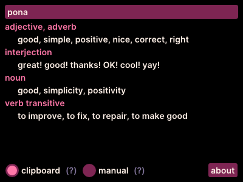

# nimi pi toki pona

kama pona

This is a dictionary for the constructed language toki pona. It looks up the definition for the word in your clipboard (with any spaces removed). You can also type a word manually if you'd like.

It's windows only at the moment, but it should be buildable on OSX and Linux with the right versions of SDL and GLEW. I haven't tested this because I've only got a windows dev machine, sorry!

## dictionaries

It looks for a "dictionary.json" file in the same folder as the exe. I have included a dictionary parsed from jan Lope's [Toki_Pona_Lessons_English](https://github.com/jan-Lope/Toki_Pona_lessons_English).

The structure of the dictionary should clear from the file.

mi wile e ni: ilo ni li pona tawa sina a!

tawa pona
